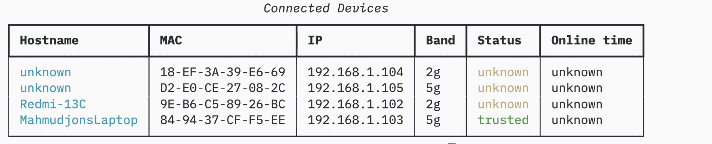

# WifiTracker

A CLI tool for managing your TP-Link Wifi routers — monitor connected devices, trust/block them, and run a background daemon on Raspberry Pi.

---

## Preview



---

## Features

- 📋 List all connected devices with status (trusted / unknown / blocked)
- ✅ Trust or block devices by MAC address
- ⏱ See how long each device has been online
- 🔍 Filter only active devices
- 🤖 Background monitor daemon — alerts on unknown devices
- 🚫 Auto-block unknown devices
- 📶 Enable/disable WiFi bands (2.4GHz / 5GHz)
- 🔁 Reboot the router from the terminal

---

## Setup

### 1. Install dependencies

```bash
pip install tplinkrouterc6u typer rich
```

### 2. Configure router credentials

```bash
python -m wifitracker setup --host http://192.168.1.1 --password yourpassword
```

Credentials are saved to `~/.wifitracker/setup.json` and loaded automatically.

---

## Usage

Notice that you can use commands with prefix `python -m` as well as without it `wifitracker devices list`

### Devices

```bash
# List all connected devices
python -m wifitracker devices list

# Show only active devices
python -m wifitracker devices list --only-active

# Trust a device
python -m wifitracker devices trust AA:BB:CC:DD:EE:FF

# Untrust a device
python -m wifitracker devices untrust AA:BB:CC:DD:EE:FF

# Block a device
python -m wifitracker devices block AA:BB:CC:DD:EE:FF

# Unblock a device
python -m wifitracker devices unblock AA:BB:CC:DD:EE:FF
```

### Monitor

```bash
# Start background monitor
python -m wifitracker monitor start

# Start and auto-block unknown devices
python -m wifitracker monitor start --auto-block

# Check monitor status
python -m wifitracker monitor status

# Stop monitor
python -m wifitracker monitor stop
```

### WiFi

```bash
# Turn off 5GHz band
python -m wifitracker wifi off 5g

# Turn on 5GHz band
python -m wifitracker wifi on 5g
```

### Reboot

```bash
python -m wifitracker reboot
```

---

## Project Structure

```
wifitracker/
├── wifitracker/
│   ├── config.py        ← settings and setup file loader
│   ├── router.py        ← tplinkrouterc6u wrapper
│   ├── trust_store.py   ← JSON persistence for trusted/blocked devices
│   ├── monitor.py       ← background daemon
│   ├── notifier.py      ← terminal alerts
│   └── main.py          ← Typer CLI entry point
└── tests/
    ├── test_router.py
    ├── test_trust_store.py
    └── test_monitor.py
```

---

## Running Tests

```bash
pytest tests/ -v
```

---

## Raspberry Pi — Run on Boot

```ini
# /etc/systemd/system/wifitracker.service
[Unit]
Description=WifiTracker Monitor
After=network.target

[Service]
ExecStart=/usr/bin/python -m wifitracker monitor start --auto-block
WorkingDirectory=/home/pi/wifitracker
Restart=on-failure
User=pi

[Install]
WantedBy=multi-user.target
```

```bash
sudo systemctl enable wifitracker
sudo systemctl start wifitracker
```
